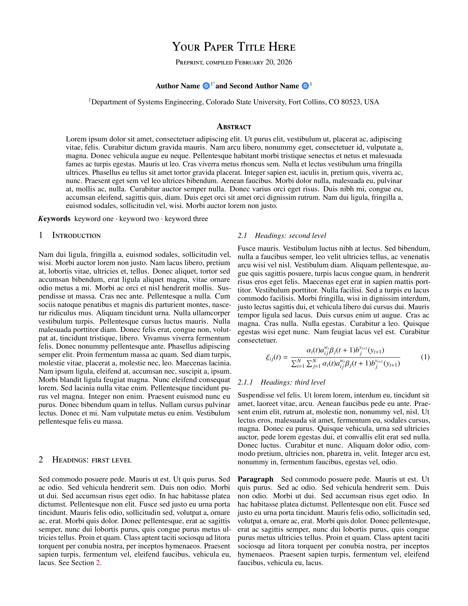

# arXiv (Two Column)

A two-column preprint template based on the arXiv submission guide, originally created by [Brenhin Keller](https://github.com/brenhinkeller).

- Original Author: [Brenhin Keller](https://github.com/brenhinkeller)
- License: MIT
- [Source Repository](https://github.com/brenhinkeller/preprint-template.tex)

## Changelog

### 2026-02-20 — Sinan Bank (sinan.bank@colostate.edu)

- Replaced ORCID icon/link with Google Scholar icon/link
- Removed all Jinja2/MyST template syntax; file is now directly compilable with `pdflatex`/`latexmk`
- Removed ORCID helper code from `preprint.sty`
- Made cropmark tick marks conditional via `\usepackage[cropmarks]{preprint}` option in `preprint.sty`
- Added packages: `url`, `xurl`, `booktabs`, `nicefrac`, `microtype`, `graphicx`, `float`, `placeins`, `lipsum`
- Added `\shorttitle` and `\fancyhead` override for header
- Changed hyperref `urlcolor` from blue to cyan
- Cleaned stale packages (`scalerel`, `amsthm`) from `template.yml`
- Updated `thumbnail.png` from compiled first page
